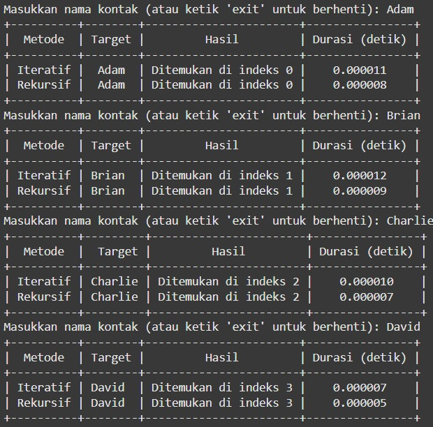
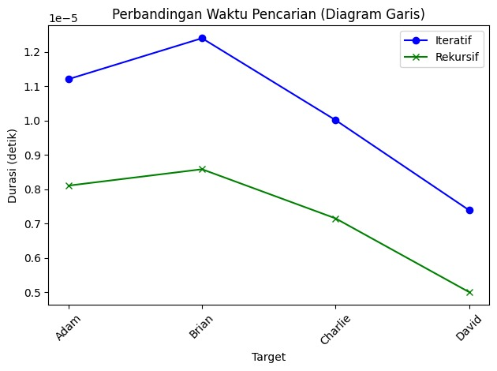

# <h1 align = "center">TUGAS BESAR ANALISIS KOMPLEKSITAS ALGORITMA </h1>
# <h2 align="center"> Analisis perbandingan algoritma binary search (rekursif) dan binary search (iteratif) dalam mencari kontak telepon </h2>

### Anggota Kelompok
Daffa Falih Aqilah - 2311102137 </br>
Mohammad Nizal Maulana - 2311102150 </br>
Kelas S1IF-11-04</br>
Telkom University Purwokerto <br/>

### Algoritma Binary Search dengan pendekatan rekursif <br/>
Binary Search dengan pendekatan rekursif adalah algoritma pencarian efisien yang digunakan untuk menemukan elemen dalam array yang telah diurutkan. Algoritma ini membagi ruang pencarian menjadi dua bagian secara berulang hingga elemen yang dicari ditemukan atau ruang pencarian habis. Dalam pendekatan rekursif, fungsi akan memeriksa elemen tengah array. Jika elemen tengah adalah elemen yang dicari, pencarian selesai. Jika elemen yang dicari lebih kecil dari elemen tengah, fungsi akan memanggil dirinya sendiri pada separuh kiri array. Sebaliknya, jika elemen yang dicari lebih besar, fungsi akan memanggil dirinya sendiri pada separuh kanan array. Proses ini berlanjut hingga elemen ditemukan atau batas pencarian menyempit menjadi nol. Pendekatan ini memanfaatkan prinsip "divide and conquer" dengan kompleksitas waktu O(log n)

berikut merupakan contoh function binary search dengan pendekatan rekursif:
```py
def binary_search_recursive(kontak, target, minim, maks):
    if minim > maks:
        return -1
    tengah = (minim + maks) // 2
    if kontak[tengah] == target:
        return tengah
    elif kontak[tengah] < target:
        return binary_search_recursive(kontak, target, tengah + 1, maks)
    else:
        return binary_search_recursive(kontak, target, minim, tengah - 1)
```

### Algoritma Binary Search dengan pendekatan Iteratif <br/>
Binary Search dengan pendekatan iteratif adalah algoritma pencarian efisien yang digunakan untuk menemukan elemen dalam array yang telah diurutkan. Tidak seperti pendekatan rekursif, algoritma ini menggunakan loop untuk secara berulang membagi ruang pencarian menjadi dua bagian hingga elemen yang dicari ditemukan atau ruang pencarian habis. Algoritma dimulai dengan menetapkan batas awal (low) dan batas akhir (high) array. Selama batas awal kurang dari atau sama dengan batas akhir, elemen tengah array dihitung dan dibandingkan dengan elemen yang dicari. Jika elemen tengah adalah elemen yang dicari, pencarian selesai. Jika elemen yang dicari lebih kecil dari elemen tengah, batas akhir diperbarui menjadi indeks sebelum elemen tengah. Jika elemen yang dicari lebih besar, batas awal diperbarui menjadi indeks setelah elemen tengah. Proses ini berlanjut hingga elemen ditemukan atau batas awal melampaui batas akhir. Pendekatan ini juga menggunakan prinsip "divide and conquer" dengan kompleksitas waktu O(log n).

berikut merupakan contoh function binary search dengan pendekatan iteratif:
```py
def binary_search_iterative(kontak, target):
    minim = 0
    maks = len(kontak) - 1

    while minim <= maks:
        tengah = (minim + maks) // 2
        if kontak[tengah] == target:
            return tengah
        elif kontak[tengah] < target:
            minim = tengah + 1
        else:
            maks = tengah - 1
    return -1
```

### Program kesuluruhan <br/>
```py
import time
import matplotlib.pyplot as plt
from prettytable import PrettyTable

def binary_search_iterative(kontak, target):
    minim = 0
    maks = len(kontak) - 1

    while minim <= maks:
        tengah = (minim + maks) // 2
        if kontak[tengah] == target:
            return tengah
        elif kontak[tengah] < target:
            minim = tengah + 1
        else:
            maks = tengah - 1
    return -1

def binary_search_recursive(kontak, target, minim, maks):
    if minim > maks:
        return -1
    tengah = (minim + maks) // 2
    if kontak[tengah] == target:
        return tengah
    elif kontak[tengah] < target:
        return binary_search_recursive(kontak, target, tengah + 1, maks)
    else:
        return binary_search_recursive(kontak, target, minim, tengah - 1)

if __name__ == "__main__":
    kontak = [
        "Adam", "Brian", "Charlie", "David", "Emily",
        "Frank", "George", "Hannah", "Isabel", "Jack",
        "Katie", "Lily", "Mason", "Natalie", "Oscar",
        "Peter", "Quinn", "Rachel", "Sarah", "Tom",
        "Uma", "Victor", "Wendy", "Xander", "Yara", "Zane",
    ]
    
    # List untuk menyimpan hasil waktu eksekusi untuk setiap pencarian
    iterative_times = []
    recursive_times = []
    targets = []

    # Loop untuk input target beberapa kali
    while True:
        target = input("Masukkan nama kontak (atau ketik 'exit' untuk berhenti): ")
        
        if target.lower() == 'exit':
            break

        # Ukur waktu untuk iteratif
        start_iterative = time.time()
        index_iterative = binary_search_iterative(kontak, target)
        durasi_iterative = time.time() - start_iterative

        # Ukur waktu untuk rekursif
        start_recursive = time.time()
        index_recursive = binary_search_recursive(kontak, target, 0, len(kontak) - 1)
        durasi_recursive = time.time() - start_recursive

        # Menyimpan data untuk grafik
        targets.append(target)
        iterative_times.append(durasi_iterative)
        recursive_times.append(durasi_recursive)

        # Tampilkan hasil dalam tabel
        table = PrettyTable()
        table.field_names = ["Metode", "Target", "Hasil", "Durasi (detik)"]

        if index_iterative != -1:
            table.add_row(["Iteratif", target, f"Ditemukan di indeks {index_iterative}", f"{durasi_iterative:.6f}"])
        else:
            table.add_row(["Iteratif", target, "Tidak ditemukan", f"{durasi_iterative:.6f}"])

        if index_recursive != -1:
            table.add_row(["Rekursif", target, f"Ditemukan di indeks {index_recursive}", f"{durasi_recursive:.6f}"])
        else:
            table.add_row(["Rekursif", target, "Tidak ditemukan", f"{durasi_recursive:.6f}"])

        print(table)

    # Visualisasi waktu pencarian menggunakan diagram garis
    plt.plot(targets, iterative_times, label="Iteratif", marker='o', color='blue')
    plt.plot(targets, recursive_times, label="Rekursif", marker='x', color='green')
    
    plt.xlabel("Target")
    plt.ylabel("Durasi (detik)")
    plt.title("Perbandingan Waktu Pencarian (Diagram Garis)")
    plt.legend()
    plt.xticks(rotation=45)  # Agar nama target tidak tumpang tindih
    plt.tight_layout()  # Menyesuaikan tampilan agar tidak terpotong
    plt.show()

```
### Output <br/>



### Kesimpulan <br/>
Dari tabel, hasil pencarian membuktikan bahwa kedua metode mampu menemukan target dengan hasil yang sama (indeks target yang sesuai), namun rekursif secara konsisten lebih cepat. Hal ini menunjukkan bahwa dalam skenario pencarian sederhana seperti ini, metode rekursif menawarkan efisiensi waktu yang lebih baik dibandingkan iteratif.

Berdasarkan data dan grafik yang ditampilkan, kompleksitas waktu untuk pencarian iteratif dan rekursif dalam kasus ini sama, yaitu O(n), di mana 𝑛 n adalah jumlah elemen dalam daftar.

- Iteratif: Metode iteratif melakukan pencarian linear dari indeks pertama hingga menemukan target. Dalam kasus terburuk, ia harus memeriksa seluruh elemen, sehingga kompleksitasnya adalah 𝑂(𝑛).
- Rekursif: Pencarian rekursif juga bekerja dengan cara yang sama, memeriksa satu per satu elemen dari awal hingga target ditemukan. Karena setiap pemanggilan rekursif mengurangi ukuran daftar (atau mempersempit pencarian satu langkah), kompleksitasnya tetap O(n).

- Meskipun kompleksitas waktu keduanya 𝑂(𝑛), metode rekursif lebih cepat dalam hal durasi aktual karena overhead fungsi iteratif (misalnya, perulangan) lebih tinggi dibandingkan overhead pemanggilan rekursif pada skala kecil ini.
- Perbedaan ini lebih terlihat pada skala kecil, tetapi seiring bertambahnya ukuran data, performa rekursif bisa menurun karena overhead stack (rekursi mendalam)

Jadi Kompleksitas waktu untuk pencarian iteratif dan rekursif adalah O(n). Namun, dalam implementasi praktis, rekursif lebih cepat dalam skala kecil karena overhead iteratif lebih besar dibandingkan rekursif.