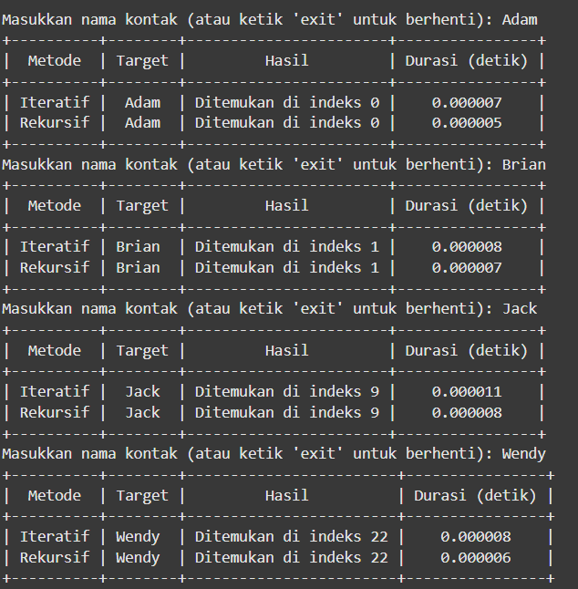
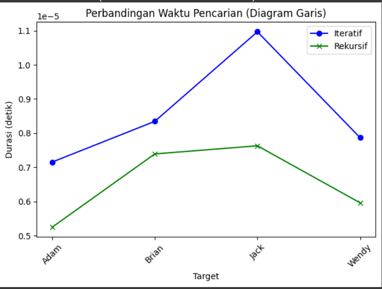

# <h1 align = "center">TUGAS BESAR ANALISIS KOMPLEKSITAS ALGORITMA </h1>
# <h2 align="center"> Analisis perbandingan algoritma binary search (rekursif) dan binary search (iteratif) dalam mencari kontak telepon </h2>

### Anggota Kelompok
Daffa Falih Aqilah - 2311102137 </br>
Mohammad Nizal Maulana - 2311102150 </br>
Kelas S1IF-11-04</br>
Telkom University Purwokerto <br/>

### Studi Kasus </br>
Studi kasus dalam analisis perbandingan algoritma binary search (rekursif) dan binary search (iteratif) difokuskan pada efisiensi waktu pencarian kontak telepon dalam daftar yang sudah terurut secara alfabetis. dengan data sebanyak 26 data kontak, Analisis dilakukan untuk membandingkan waktu eksekusi kedua algoritma dalam menemukan nama. Tujuannya adalah menentukan algoritma yang lebih cepat dalam skenario pencarian data sederhana.

### Binary Search <br/>
Binary search adalah algoritma pencarian yang digunakan untuk menemukan posisi suatu elemen dalam daftar yang sudah diurutkan. Algoritma ini bekerja dengan membagi daftar menjadi dua bagian pada setiap langkah. Proses dimulai dengan membandingkan elemen tengah daftar dengan elemen yang dicari. Jika elemen tengah sama dengan elemen yang dicari, maka proses pencarian selesai. Namun, jika elemen tengah lebih besar, pencarian dilanjutkan ke bagian kiri daftar, sedangkan jika elemen tengah lebih kecil, pencarian diteruskan ke bagian kanan. Dengan cara ini, binary search secara sistematis mempersempit ruang pencarian hingga elemen ditemukan atau hingga ruang pencarian habis.
Algoritma ini sangat efisien karena mengurangi jumlah elemen yang harus diperiksa secara eksponensial. Dengan kompleksitas waktu rata-rata sebesar
O(logn), binary search jauh lebih cepat dibandingkan metode pencarian linear untuk daftar yang besar. Namun, salah satu syarat utama penggunaannya adalah daftar harus diurutkan terlebih dahulu. Jika daftar belum diurutkan, algoritma ini tidak dapat diterapkan dengan benar. Binary search sering digunakan dalam berbagai aplikasi, seperti pencarian data dalam basis data, pengambilan informasi, dan operasi pada array yang telah diurutkan.

### Algoritma Binary Search dengan pendekatan rekursif <br/>
Binary Search dengan pendekatan rekursif adalah algoritma pencarian efisien yang digunakan untuk menemukan elemen dalam array yang telah diurutkan. Algoritma ini membagi ruang pencarian menjadi dua bagian secara berulang hingga elemen yang dicari ditemukan atau ruang pencarian habis. Dalam pendekatan rekursif, fungsi akan memeriksa elemen tengah array. Jika elemen tengah adalah elemen yang dicari, pencarian selesai. Jika elemen yang dicari lebih kecil dari elemen tengah, fungsi akan memanggil dirinya sendiri pada separuh kiri array. Sebaliknya, jika elemen yang dicari lebih besar, fungsi akan memanggil dirinya sendiri pada separuh kanan array. Proses ini berlanjut hingga elemen ditemukan atau batas pencarian menyempit menjadi nol. Pendekatan ini memanfaatkan prinsip "divide and conquer" dengan kompleksitas waktu O(log n)

berikut merupakan contoh function binary search dengan pendekatan rekursif:
```py
def binary_search_recursive(kontak, target, minim, maks):
    if minim > maks:
        return -1
    tengah = (minim + maks) // 2
    if kontak[tengah] == target:
        return tengah
    elif kontak[tengah] < target:
        return binary_search_recursive(kontak, target, tengah + 1, maks)
    else:
        return binary_search_recursive(kontak, target, minim, tengah - 1)
```

### Algoritma Binary Search dengan pendekatan Iteratif <br/>
Binary Search dengan pendekatan iteratif adalah algoritma pencarian efisien yang digunakan untuk menemukan elemen dalam array yang telah diurutkan. Tidak seperti pendekatan rekursif, algoritma ini menggunakan loop untuk secara berulang membagi ruang pencarian menjadi dua bagian hingga elemen yang dicari ditemukan atau ruang pencarian habis. Algoritma dimulai dengan menetapkan batas awal (low) dan batas akhir (high) array. Selama batas awal kurang dari atau sama dengan batas akhir, elemen tengah array dihitung dan dibandingkan dengan elemen yang dicari. Jika elemen tengah adalah elemen yang dicari, pencarian selesai. Jika elemen yang dicari lebih kecil dari elemen tengah, batas akhir diperbarui menjadi indeks sebelum elemen tengah. Jika elemen yang dicari lebih besar, batas awal diperbarui menjadi indeks setelah elemen tengah. Proses ini berlanjut hingga elemen ditemukan atau batas awal melampaui batas akhir. Pendekatan ini juga menggunakan prinsip "divide and conquer" dengan kompleksitas waktu O(log n).

berikut merupakan contoh function binary search dengan pendekatan iteratif:
```py
def binary_search_iterative(kontak, target):
    minim = 0
    maks = len(kontak) - 1

    while minim <= maks:
        tengah = (minim + maks) // 2
        if kontak[tengah] == target:
            return tengah
        elif kontak[tengah] < target:
            minim = tengah + 1
        else:
            maks = tengah - 1
    return -1
```

### Program kesuluruhan <br/>
```py
import time
import matplotlib.pyplot as plt
from prettytable import PrettyTable

def binary_search_iterative(kontak, target):
    minim = 0
    maks = len(kontak) - 1

    while minim <= maks:
        tengah = (minim + maks) // 2
        if kontak[tengah] == target:
            return tengah
        elif kontak[tengah] < target:
            minim = tengah + 1
        else:
            maks = tengah - 1
    return -1

def binary_search_recursive(kontak, target, minim, maks):
    if minim > maks:
        return -1
    tengah = (minim + maks) // 2
    if kontak[tengah] == target:
        return tengah
    elif kontak[tengah] < target:
        return binary_search_recursive(kontak, target, tengah + 1, maks)
    else:
        return binary_search_recursive(kontak, target, minim, tengah - 1)

if __name__ == "__main__":
    kontak = [
        "Adam", "Brian", "Charlie", "David", "Emily",
        "Frank", "George", "Hannah", "Isabel", "Jack",
        "Katie", "Lily", "Mason", "Natalie", "Oscar",
        "Peter", "Quinn", "Rachel", "Sarah", "Tom",
        "Uma", "Victor", "Wendy", "Xander", "Yara", "Zane",
    ]
    
    # List untuk menyimpan hasil waktu eksekusi untuk setiap pencarian
    iterative_times = []
    recursive_times = []
    targets = []

    # Loop untuk input target beberapa kali
    while True:
        target = input("Masukkan nama kontak (atau ketik 'exit' untuk berhenti): ")
        
        if target.lower() == 'exit':
            break

        # Ukur waktu untuk iteratif
        start_iterative = time.time()
        index_iterative = binary_search_iterative(kontak, target)
        durasi_iterative = time.time() - start_iterative

        # Ukur waktu untuk rekursif
        start_recursive = time.time()
        index_recursive = binary_search_recursive(kontak, target, 0, len(kontak) - 1)
        durasi_recursive = time.time() - start_recursive

        # Menyimpan data untuk grafik
        targets.append(target)
        iterative_times.append(durasi_iterative)
        recursive_times.append(durasi_recursive)

        # Tampilkan hasil dalam tabel
        table = PrettyTable()
        table.field_names = ["Metode", "Target", "Hasil", "Durasi (detik)"]

        if index_iterative != -1:
            table.add_row(["Iteratif", target, f"Ditemukan di indeks {index_iterative}", f"{durasi_iterative:.6f}"])
        else:
            table.add_row(["Iteratif", target, "Tidak ditemukan", f"{durasi_iterative:.6f}"])

        if index_recursive != -1:
            table.add_row(["Rekursif", target, f"Ditemukan di indeks {index_recursive}", f"{durasi_recursive:.6f}"])
        else:
            table.add_row(["Rekursif", target, "Tidak ditemukan", f"{durasi_recursive:.6f}"])

        print(table)

    # Visualisasi waktu pencarian menggunakan diagram garis
    plt.plot(targets, iterative_times, label="Iteratif", marker='o', color='blue')
    plt.plot(targets, recursive_times, label="Rekursif", marker='x', color='green')
    
    plt.xlabel("Target")
    plt.ylabel("Durasi (detik)")
    plt.title("Perbandingan Waktu Pencarian (Diagram Garis)")
    plt.legend()
    plt.xticks(rotation=45)  
    plt.tight_layout()  
    plt.show()

```
### Output <br/>




### Analis <br/>
Berdasarkan tabel yang disajikan, hasil pencarian menggunakan metode iteratif dan rekursif menunjukkan bahwa keduanya mampu menemukan target dengan akurasi yang sama, di mana setiap target seperti "Adam," "Brian," "Jack," dan "Wendy" ditemukan pada indeks yang sesuai dalam data. Namun, terdapat perbedaan kecil dalam durasi waktu pencarian antara kedua metode. Metode iteratif cenderung membutuhkan waktu sedikit lebih lama dibandingkan metode rekursif. Sebagai contoh, pencarian nama "Adam" dengan metode iteratif membutuhkan waktu 0.00007 detik, sedangkan metode rekursif hanya membutuhkan waktu 0.00005 detik. Hal serupa terjadi pada pencarian nama lainnya, di mana rekursif consistently menunjukkan durasi yang lebih pendek dibandingkan iteratif. Meski perbedaan waktu ini sangat kecil dan berada dalam kisaran mikrodetik, hasil ini menunjukkan bahwa metode rekursif lebih efisien dalam konteks waktu. Dengan demikian, kedua metode dapat digunakan secara efektif untuk pencarian data, tetapi rekursif dapat menjadi pilihan yang lebih baik jika efisiensi waktu menjadi prioritas. namun hal ini juga dipengaruhi oleh panjangnya data, besarnya index yang di inputkan dan spesifikasi perangkat 

 kompleksitas waktu untuk metode pencarian tersebut adalah O(log N). Namun, ini hanya berlaku jika daftar kontak sudah terurut.

### Kesimpulan <br/>
Kesimpulan dari percobaan diatas, dapat disimpulkan bahwa Algoritma Iteratif menggunakan perulangan kalau dalam kode yang kami buat algoritma iteratif terdapat sebuah perulangan yaitu while. Alur eksekusi rekursif mengulang pengecekan dan pembaruan batas pencarian dalam sebuah loop hingga ditemukan elemen atau tidak ada lagi ruang pencarian.
Algoritma Rekursif Menggunakan rekursi (panggilan fungsi dalam fungsi itu sendiri) untuk memecah masalah menjadi sub-masalah lebih kecil.Fungsi mulai dengan mendefinisikan batas pencarian, kemudian memanggil dirinya sendiri dengan batas yang lebih kecil sampai kondisi pencarian tercapai.
dan juga waktu eksekusi dari algoritma rekursif lebih cepat dibandingkan dengan iteratif. Kedua algoritma binary search ini (iteratif dan rekursif) sama sama memiliki kompleksitas waktu O(log n).